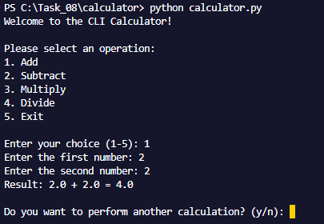
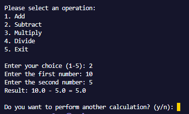
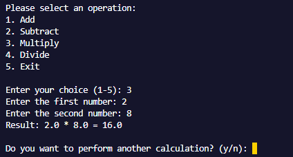

# AIDD 30-Day Challenge - Task 08

## Task Overview

This task involves building a **Simple Calculator** using **SpecKitPlus**, following all **5 phases** of development:

1. **/constitution** – Define the purpose, goals, and requirements of the calculator.
2. **/specify** – Specify the calculator's features, operations, and user interactions.
3. **/plan** – Outline the plan to implement the calculator, including structure and workflow.
4. **/tasks** – Break down the implementation into smaller tasks and assign priorities.
5. **/implement** – Code and test the calculator based on the specifications and plan.

---

## Implementation & Testing

The calculator was implemented as per the phases defined above. Below are the **screenshots of test cases** demonstrating the functionality:

1. **Addition Test**
   

2. **Subtraction Test**
   

3. **Multiplication Test**
   

> Ensure all screenshots are placed in the `screenshots` folder and referenced correctly.

---

## Features

- Perform basic arithmetic operations: Addition, Subtraction, Multiplication, Division
- User-friendly interface
- Validates input to prevent errors (e.g., division by zero)
