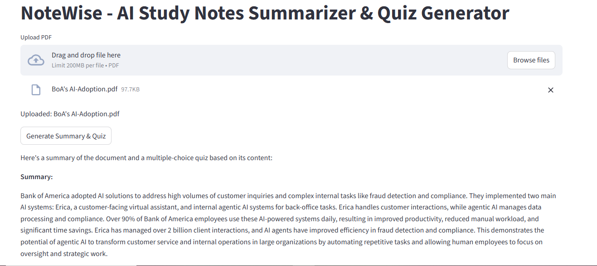

# AIDD 30-Day Challenge - Task 04

## Practical Task — Build the Study Notes Summarizer & Quiz Generator Agent

### Connecting Context7 MCP Server to Gemini CLI
For today’s task, you will connect the Context7 MCP server to your Gemini CLI.

After Context7 is connected, you will create an agent using:
* OpenAgents SDK
* Streamlit (recommended for UI, but HTML/CSS is allowed your choice)
* PyPDF (for PDF text extraction)
* Gemini CLI
* Context7 MCP (tool provider)

What the Agent Will Do
A. PDF Summarizer
* User uploads a PDF.
* Text is extracted using PyPDF.
* Agent generates a clean, meaningful summary.
* Summary can appear in any UI style students choose (card, block,
container, etc.).

B. Quiz Generator
* After summarization, the user can click Create Quiz.
* The agent reads the original PDF (not the summary).
* It generates:
○ MCQs
○ Or mixed-style quizzes

---

### Code = https://github.com/AyeshaQadir7/NoteWise_AI
### Live Link = https://notewise.streamlit.app/
