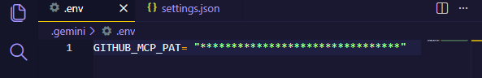
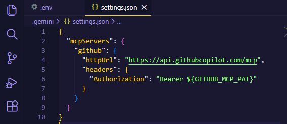
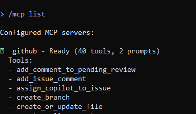
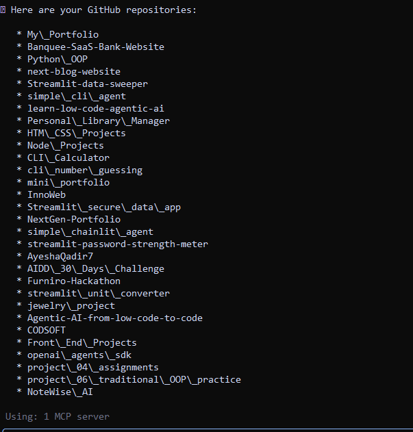

# AIDD 30-Day Challenge - Task 06

## GitHub × MCP Integration (Hosted Method)


### Overview

Full process I followed to complete **Task 6: GitHub MCP Server Integration using the Hosted Method**.

The objective was to configure the **Google Gemini CLI** to connect with the **GitHub MCP Server**, enabling AI-powered access to my GitHub repositories.

This setup requires **no Docker**, **no local MCP installation**, and uses a **remote MCP server** with a GitHub Personal Access Token (PAT).

---

## Steps Completed

## **1. Created a GitHub Personal Access Token (PAT)**

* Navigated to:
  [https://github.com/settings/personal-access-tokens/new](https://github.com/settings/personal-access-tokens/new)
* Generated a **Fine-grained** token with:

  * ✔ repo (Read & Write)

---

## **2. Stored Token Securely in a `.env` File**

Created a `.env` file inside Gemini CLI directory.



⚠️ Token was NOT placed directly inside `settings.json`.

---

## **3. Configured Gemini to Use the GitHub MCP Server**

Opened or created:

```
settings.json
```

Added the MCP server configuration:




## **4. Restarted the Gemini CLI**

```
gemini
```

---

## **5. Verified MCP Connection**

Ran:

```
/mcp list
```

Received:



---

## **6. Tested the GitHub Server**

Asked Gemini:

```
List my GitHub repositories
```

Gemini successfully listed my repo names, confirming that MCP is fully connected.



---

# Task Completed Successfully

* GitHub Token created ✔
* Token stored securely in `.env` ✔
* `settings.json` configured ✔
* Gemini CLI restarted ✔
* MCP server detected ✔
* Repositories listed ✔

This completes **Task 6** of the AI-Driven Development Challenge.

---

