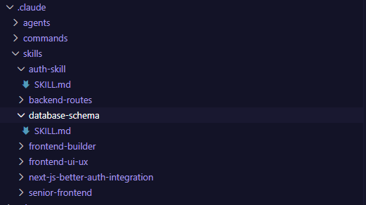

# AIDD 30-Day Challenge - Task 09

## Task Objective

Students will learn and create Claude Code Skills and Sub-Agents for generating a book. Completing this task also helps prepare for the upcoming Hackathon.

---

## Understanding the Concepts

### What are Claude Code Skills?

Skills are reusable, specialized capabilities that you create in Claude Code to perform specific tasks. Think of them as custom tools, such as a "research skill" or "writing style skill," that make Claude more powerful and tailored to your needs.

Skills allow you to:

- Automate repetitive tasks
- Create specialized workflows
- Extend Claude Code functionality
- Build modular, reusable components
- Enhance productivity for specific use cases

---

## Key Learning Areas

1. **Skill Creation** - How to structure and write custom Claude Code skills
2. **Sub-Agents** - Understanding sub-agents and when to use them
3. **Automation** - Automating the book writing process using skills
4. **Integration** - Integrating custom skills into Claude Code workflows

---

## Custom Skills Created

Below is a screenshot of the `.claudecode` directory structure showing the custom skills and sub-agents created for the book generation process:

---

## Implementation Details

The custom skills have been organized in the `.claudecode` directory with the following structure:

- **Skill Configuration Files** - Define the skill metadata and available parameters
- **Skill Scripts** - Implement the core functionality for each skill
- **Sub-Agent Integration** - Configure sub-agents to work with the skills for enhanced automation

These skills enable:

- Automated research gathering
- Content generation with specific writing styles
- Book structure organization
- Chapter-by-chapter content management
- Editing and refinement workflows

---

## Benefits of Custom Skills

✅ **Reusability** - Use the same skills across multiple projects
✅ **Efficiency** - Automate repetitive tasks in the book writing process
✅ **Customization** - Tailor skills to your specific writing needs
✅ **Collaboration** - Share skills with team members
✅ **Scalability** - Build complex workflows by combining multiple skills

---

## Resources

- [Claude Code Skills Documentation](https://claude.com/docs/claude-code)
- [Creating Custom Skills Guide](https://claude.com/docs/claude-code/skills)
- [Sub-Agents Documentation](https://claude.com/docs/claude-code/sub-agents)

---

## Conclusion

By creating custom Claude Code skills, you've enabled intelligent automation for the book generation process. These skills serve as a foundation for more advanced workflows and demonstrate the power of extending Claude Code with specialized capabilities tailored to your unique needs.

This hands-on experience with skill creation prepares you for building sophisticated solutions in the upcoming Hackathon!

---

> **Next Steps:** Share your skills with teammates and explore how these custom capabilities can enhance collaborative book writing and development workflows.
