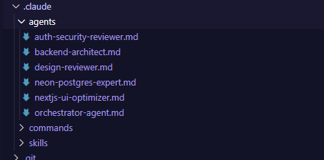

# AIDD 30-Day Challenge - Task 10

## Task Objective

Students will learn and create Claude Code Skills and Sub-Agents for generating a book. Completing this task also helps prepare for the upcoming Hackathon.

---

## Understanding the Concepts

### What are Sub-Agents?

Sub-Agents are specialized AI agents that work together under a main orchestrator to handle different parts of a complex task. Rather than having one monolithic agent handle everything, Sub-Agents allow you to decompose complex workflows into smaller, focused agents that each excel at their specific domain.

Sub-Agents enable you to:
- **Divide and Conquer** - Break complex tasks into smaller, manageable parts
- **Specialization** - Create agents specialized for specific domains or tasks
- **Parallel Processing** - Run multiple agents concurrently for efficiency
- **Better Error Handling** - Isolate failures to specific agents
- **Improved Modularity** - Build and maintain cleaner, more organized workflows

---

## Key Learning Areas

1. **Sub-Agent Architecture** - How to design and structure sub-agents
2. **Orchestration** - Managing communication between sub-agents
3. **Delegation** - Deciding when and how to delegate tasks to sub-agents
4. **Integration** - Integrating sub-agents into your Claude Code workflows
5. **Book Generation** - Using sub-agents to collaboratively generate a book

---

## Sub-Agents in Action

Below is a screenshot of the Sub-Agent architecture and configuration created for the book generation process:

---

## Implementation Details

The sub-agents have been configured to work together in the following ways:

### Agent Roles

- **Research Agent** - Gathers information and references for book topics
- **Writing Agent** - Generates content based on research and guidelines
- **Editing Agent** - Reviews and refines generated content
- **Structure Agent** - Organizes content into proper book structure
- **Quality Agent** - Ensures consistency and quality across chapters

### Orchestration Pattern

The main orchestrator:
- Receives the book generation request
- Delegates research tasks to the Research Agent
- Sends research outputs to the Writing Agent
- Routes content through the Editing Agent
- Manages chapter organization via the Structure Agent
- Validates output through the Quality Agent
- Compiles the final book

---

## Benefits of Sub-Agents

✅ **Efficiency** - Agents work on their specialties, reducing errors and improving speed
✅ **Scalability** - Easily add more agents for new capabilities
✅ **Maintainability** - Each agent focuses on one responsibility
✅ **Parallel Execution** - Multiple agents work simultaneously on different tasks
✅ **Resilience** - Failure in one agent doesn't crash the entire system
✅ **Flexibility** - Swap or upgrade individual agents without affecting others

---

## How Sub-Agents Differ from Skills

| Aspect | Skills | Sub-Agents |
|--------|--------|-----------|
| **Purpose** | Reusable capabilities/tools | Autonomous agents for complex workflows |
| **Complexity** | Usually simpler, single-purpose | More complex, multi-step decision making |
| **Independence** | Stateless operations | Can maintain state and context |
| **Execution** | Synchronous or simple async | Full AI autonomy with reasoning |
| **Use Case** | Specific utilities | Complex collaborative tasks |

---

## Resources

- [Claude Code Sub-Agents Documentation](https://claude.com/docs/claude-code/sub-agents)
- [Agent Orchestration Guide](https://claude.com/docs/claude-code/agent-orchestration)
- [Building Collaborative Workflows](https://claude.com/docs/claude-code/workflows)

---

## Conclusion

By mastering Sub-Agents, you've unlocked the ability to create sophisticated, collaborative AI systems where specialized agents work together seamlessly. This architecture is particularly powerful for complex tasks like book generation, where different phases require different expertise.

The sub-agent pattern you've implemented here serves as a blueprint for:
- Content creation platforms
- Data processing pipelines
- Multi-stage validation systems
- Collaborative knowledge work
- Hackathon-winning applications

---

> **Next Steps:** Combine your Skills (Task 09) with Sub-Agents (Task 10) to create an even more powerful book generation system that leverages both reusable capabilities and intelligent autonomous agents!
